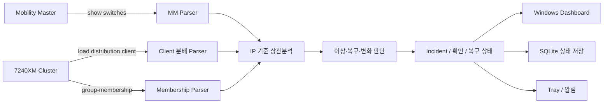

# Aruba MM / WLC 상태 모니터링

[](https://github.com/sebia1993/aruba-cluster-health-dashboard/actions/workflows/ci-windows.yml)
[](LICENSE)

**Aruba Mobility Master(MM)와 7240XM 클러스터 상태를 읽기 전용 SSH로 수집·상관분석하고, 필요할 때만 별도로 켜는 자동 Controller 장애조치를 제공하는 Windows 네트워크 운영 도구입니다.**

단순 Ping 또는 SSH 접속 성공 여부가 아니라 **MM 보고 상태, Active/Standby Client 분배, Cluster Connection-Type을 함께 비교**하고, 일시적인 수집 실패나 순간적인 Client 감소를 실제 WLC 장애로 오인하지 않는 것을 핵심 설계 목표로 삼았습니다.

> 저장소의 화면 예시와 테스트 데이터는 비식별 fixture와 문서용 주소만 사용합니다. 실제 운영망 IP, Hostname, 계정, 원본 명령 출력은 공개하지 않습니다.

## 포트폴리오 요약

| 채용 관점 | 내용 |
|---|---|
| 해결한 문제 | 여러 CLI 결과를 사람이 따로 대조하던 무선 클러스터 점검을 하나의 상태와 판단 근거로 통합 |
| 담당 범위 | 문제 정의, 상태 모델, Parser·상관분석, Windows UI, SSH 안전 경계, 패키징과 CI/CD |
| 핵심 판단 | 접속 실패를 장비 장애로 단정하지 않고, 연속 관측과 이전 정상 기준값으로 순간 변동의 오탐을 억제 |
| 검증 증거 | 비식별 fixture, 가짜 SSH 통합 테스트, Offscreen UI, Windows onedir 패키지와 smoke 자동 검증 |
| 증거의 한계 | 자동·합성 검증 결과이며, 실제 Aruba 장비·운영 환경 검증 및 업무 성과 수치와 구분 |

### 채용 검토 시 읽는 순서

1. [설계 판단과 소스·회귀 테스트 연결](docs/PORTFOLIO_KO.md): 수집 실패, 낮은 사용량, 연속 관측을 구분하는 근거
2. [장비 없는 Demo·fixture 재현](docs/PORTFOLIO_KO.md#장비-없이-재현하기): 예시 화면과 상태 전이를 확인하는 방법
3. [검증 보고서](docs/VALIDATION_REPORT_KO.md)와 [Windows 실행 기록](https://github.com/sebia1993/aruba-cluster-health-dashboard/actions/workflows/ci-windows.yml): 자동 검증과 현장 검증의 경계

## 한눈에 보기

| 항목 | 내용 |
|---|---|
| 대상 | Aruba Mobility Master / Aruba 7240XM Cluster |
| 수집 방식 | SSH, 읽기 전용 |
| 핵심 명령 | `show switches`, `show lc-cluster load distribution client`, `show lc-cluster group-membership` |
| 판단 단위 | 장비 IP 기준 상태 상관분석 |
| 종합 상태 | 정상 / 주의 / 장애 / 확인 불가 |
| 오탐 방지 | 연속 이상·복구 확인, 낮은 전체 사용량 구분, 수집 실패와 Down 분리 |
| 장애 전환 | MM이 명시적으로 Down을 보고한 경우 즉시 반영 |
| 수집 가용성 | Primary Controller 실패 시 등록된 Fallback 순서로 조회 시도 |
| 자격 증명 | Windows Credential Manager 또는 세션 메모리 |
| 로컬 상태 | SQLite + 비밀정보 없는 JSON 설정 |
| 운영 변경 | 기본 OFF 자동 장애조치에서 검토된 재부팅·재분배 명령만 별도 실행 |
| 실행 환경 | Windows 11 x64, PyInstaller onedir 배포 |

## 해결하려 한 운영 문제

Aruba 무선 클러스터 상태를 확인할 때 한 명령만 보면 실제 원인을 놓치거나 일시적인 현상을 장애로 오인할 수 있습니다.

- `show switches`의 Controller 상태와 Cluster Client 분배 결과를 따로 확인해야 함
- Active Client가 순간적으로 감소한 것과 지속적인 분배 이상을 구분해야 함
- 전체 사용량 자체가 낮은 시간대에는 절대 Client 수만으로 장애를 판단하면 오탐이 발생할 수 있음
- Connection-Type 변화는 이전 정상 기준값과 비교하지 않으면 변화 여부를 알기 어려움
- Primary Controller에 접속하지 못한 상황과 실제 Cluster 장애를 분리해야 함
- SSH 접속 실패, 빈 출력, Parser 실패를 WLC Down으로 잘못 판단하면 안 됨
- 여러 명령에서 같은 IP에 문제가 나타나면 운영자가 다시 수작업으로 원인을 합쳐야 함

이 프로젝트는 세 명령을 각각 보여주는 것보다 **서로 다른 관측값을 같은 장비 IP에 연결하고, 관측 신뢰도까지 포함해 최종 상태를 계산하는 것**에 초점을 둡니다.

## 핵심 설계 판단

| 운영 문제 | 설계 판단 |
|---|---|
| MM이 실제 Controller `Down`을 보고 | 정상 수집된 `show switches`의 명시적 Down은 즉시 장애 신호로 반영 |
| 순간적인 Client 감소 | 기본 3회 연속 이상을 확인한 뒤 분배 이상으로 확정 |
| 복구 직후 상태 흔들림 | 기본 2회 연속 정상 관측 후 복구로 확정 |
| Cluster 전체 사용량이 낮음 | 전체 Active Client와 Peer 기준을 함께 확인해 저사용량 상태를 장애와 분리 |
| 구성원 행이 순간적으로 누락 | 기본 3회 연속 누락을 확인해 일시적인 출력 변동을 완화 |
| Connection-Type 변화 | STATUS의 heartbeat·RTD를 제외한 타입만 baseline으로 저장하고 이후 실제 변화만 사건으로 기록 |
| Primary 조회 실패 | 등록 순서에 따른 Fallback으로 수집을 계속하되 실제 수집 Controller를 별도로 기록 |
| 접속·명령·Parser 실패 | **WLC Down으로 추정하지 않고 `확인 불가/부분 수집`으로 분리** |
| 같은 IP에 여러 문제 발생 | 원인을 IP 기준으로 누적해 하나의 종합 상태와 판단 근거로 표시 |
| 장애 확인 후 반복 알림 | 장애 상태는 유지하면서 운영자의 확인 상태와 복구 사건을 별도로 관리 |

상세한 상태 전이와 예외 조건은 [장애 판단 로직](docs/DETECTION_LOGIC_KO.md)에 정리되어 있습니다.

## 동작 구조



장비 한 대의 상태는 대략 다음 순서로 결정됩니다.

```text
SSH 수집 성공 여부
        ↓
명령별 Parser 신뢰도
        ↓
MM Controller 상태
+ Active / Standby Client
+ Connection-Type
        ↓
연속 이상 / 복구 / 누락 / baseline 비교
        ↓
IP별 원인 병합
        ↓
정상 / 주의 / 장애 / 확인 불가
```

구성요소별 책임과 데이터 흐름은 [프로그램 구조](docs/ARCHITECTURE_KO.md)를 참고하십시오.

## 장애와 수집 실패를 구분하는 기준

| 상황 | 처리 |
|---|---|
| 정상 수집된 `show switches`에서 Controller Down | 장애 |
| Client 분배가 임계조건을 한 번만 충족 | 관찰 중 |
| Client 분배가 연속 이상 기준 충족 | 주의/이상 |
| 전체 Client 사용량 자체가 낮음 | 저사용량으로 분리 |
| Cluster 구성원 행 일시 누락 | 즉시 장애로 확정하지 않음 |
| Connection-Type이 baseline과 달라짐 | 변화 사건 생성, 확인 대상 |
| SSH 연결 실패 | 확인 불가 |
| 명령 Timeout/실패 | 부분 수집 또는 확인 불가 |
| Parser가 유효한 상태를 만들지 못함 | 확인 불가 |
| Primary 실패 후 Fallback 수집 성공 | 수집은 계속하되 실제 수집 경로 기록 |

이 구분을 통해 **통신 실패를 장비 장애로 확대 해석하지 않는 것**이 중요한 안전 경계입니다.

## 실행 화면

아래는 **v0.7.0 현재 `MainWindow`**에 문서용 IP와 합성 정상·이상 snapshot을 넣어 Windows에서 렌더한 화면입니다. 실제 운영 데이터나 수집 성공 증거가 아닙니다.

[설정 → 개요 → 복수 이상 → 장애 필터 사용 흐름](docs/USAGE_SCREENSHOTS_KO.md)에서 각 화면의 읽을 값·다음 행동·캡처 SHA와 재현 명령을 확인할 수 있습니다.

### 정상 상태 예시


### 복수 이상 상태 예시


실제 장비 없이 전체 정상 → Client 연속 저하 → Connection-Type 변화 → MM Down → 복구 흐름을 확인하려면 Demo 모드를 사용할 수 있습니다.

```powershell
.\ArubaMiniDashboard.exe --demo
```

## 장비에서 실행하는 명령

운영 데이터 조회 명령은 다음 세 개로 제한합니다.

```text
show switches
show lc-cluster load distribution client
show lc-cluster group-membership
```

접속 환경에 따라 privileged EXEC 진입용 `enable`과 페이징 비활성화용 `no paging`만 세션에서 추가할 수 있습니다.

- 설정 모드에 진입하지 않습니다.
- 기본 점검에서는 구성 변경 명령을 허용하지 않습니다. 자동 장애조치는 별도 ON/OFF·allowlist·감사 저장소를 사용합니다.
- SSH 호스트 키는 자격 증명을 보내기 전에 확인합니다.
- 최초 호스트 키는 저장 과정의 한 화면에서 일괄 승인하며 변경된 키는 자동 교체하지 않습니다.
- 비밀번호와 Enable Secret은 JSON, SQLite, 일반 로그, 배포물에 저장하지 않습니다.

상세 경계는 [운영 보안 모델](docs/SECURITY_KO.md)을 참고하십시오.

## 운영 흐름

1. MM 관리 IP와 Cluster 구성원 4대를 등록합니다.
2. Cluster Primary와 Fallback 순서를 확인합니다.
3. Windows Credential Manager 또는 세션 전용 자격 증명을 선택합니다.
4. 저장을 누르고 한 화면에 표시된 SSH SHA-256 장비 지문을 확인·일괄 승인합니다.
5. 프로그램이 MM과 컨트롤러 로그인을 자동 확인한 뒤 설정을 저장합니다. MM과
   최소 1대의 컨트롤러는 반드시 성공해야 하며, 나머지는 준비 미완료 경고로 구분합니다.
6. `지금 점검`으로 첫 결과를 확인합니다.
7. 결과가 정상임을 확인한 뒤 필요하면 자동 점검을 시작합니다.
8. 장애가 발생하면 문제 IP와 판단 근거를 확인하고, 운영자가 확인 처리해 반복 알림을 제어합니다.
9. 복구 조건이 충족되면 기존 장애와 별도로 복구 이력을 남깁니다.

## 검증

자동화 검증과 실제 장비 검증을 같은 의미로 사용하지 않습니다.

| 검증 영역 | 상태 |
|---|---|
| 세 명령 Parser / 비식별 fixture | ✅ 자동 검증 |
| 이상·복구·누락 streak | ✅ 자동 검증 |
| 낮은 전체 사용량 오탐 방지 | ✅ 자동 검증 |
| Connection-Type/STATUS 열 분리, baseline / 확인 / 재시작 | ✅ 자동 검증 |
| MM Down과 수집 실패 분리 | ✅ 자동 검증 |
| Primary / Fallback 수집 경로 | ✅ 가짜 SSH·통합 테스트 |
| SQLite 상태·재시작·손상 보호 | ✅ 자동 검증 |
| Worker Thread / 중복 점검 제어 | ✅ 자동 검증 |
| Timeout·연결 끊김·잘못된 출력·저장 실패 반복 | ✅ 결정적 fault-injection / soak |
| Offscreen PySide6 UI | ✅ 자동 검증 |
| 장비표 Model/View·필터·전역 정렬·페이지 | ✅ 자동 검증 |
| Windows onedir 패키지 / smoke | ✅ GitHub Actions |
| 실제 Aruba MM / 7240XM 읽기 전용 동작 | ⚠️ 별도 현장 증거 필요 |
| Python 미설치 Windows 11 실사용 환경 | ⚠️ 별도 현장 증거 필요 |

로컬 Windows VM은 검증 경로로 사용하지 않습니다. Windows 전용 회귀, onedir 빌드와
추출 EXE smoke는 `windows-latest`에서 실행되는 GitHub Actions 결과를 기준으로
판단합니다. macOS offscreen 결과는 빠른 UI 회귀 검사이며 Windows 검증을
대체하지 않습니다.

구체적인 검증 범위와 공개 가능한 증거 수준은 [검증 보고서](docs/VALIDATION_REPORT_KO.md)에 정리되어 있습니다.

## 개발자 UI 식별 모드 안전 경계

F12 개발자 UI 식별 모드는 일반 운영 기능과 분리된 개발 보조 기능이며 **모든 새 실행은 항상 개발자 모드가 꺼진 상태로 시작**합니다.

- 활성화는 애플리케이션 창이 **수정 키 없는 직접 `F12` 입력**을 받았을 때만 가능합니다.
- `--ui-inspector` 같은 명령줄 옵션, 환경 변수, 설정 파일, 일반 메뉴와 트레이 메뉴에는 활성화 경로가 없습니다.
- 요소 선택 중 `Esc`는 요소 선택만 취소하며 개발자 모드 자체는 유지합니다.
- 요소를 클릭하면 원래 버튼·표·탭·메뉴 동작을 실행하지 않고 해당 요소의 식별 정보만 확인합니다.
- Windows 네이티브 트레이 메뉴 항목은 화면을 가로채지 않고 정적 카탈로그에서 확인합니다.
- 복사 내용에는 설정 입력값, 실제 장비 정보, 자격 증명, 원본 명령 출력, 로그 내용, 로컬 절대 경로를 포함하지 않습니다.

상세 개발 규칙은 [`DEVELOPMENT.md`](DEVELOPMENT.md)에 정리되어 있습니다.


## 자동 Controller 장애조치

`v0.5.0`부터 기존 읽기 전용 점검과 별도로 켜고 끌 수 있는 기본 OFF 자동 장애조치를 제공합니다. 등록 Controller 한 대의 명시적 Down을 확인하면 대상 SSH 최대 3회, `reload force`, MM Up 대기, 현재 Leader 재탐색, 대상 `CONNECTED` 확인, `cluster-debug bucketmap rebalance`, 사후 점검을 순서대로 수행합니다. 모든 결과는 별도 SQLite 타임라인과 상급보고용 단일 HTML로 기록합니다. 상세 내용은 [자동 Controller 장애조치](docs/AUTOMATIC_REMEDIATION_KO.md)를 참고하십시오.

### v0.6.0 구조·안정성 개선

- 보고서와 조치 시각은 항상 KST(UTC+09:00)입니다.
- 재분배 직전 동일 Leader SSH 세션에서 Membership과 MM 전체 Up을 최종 확인합니다.
- SQLite 원자적 상태 전이, 3회 연속 정상 잠금 해제, Cluster 냉각시간과 24시간
  Controller별 실행 한도를 적용합니다.
- MainWindow monkey patch를 제거하고 UI·Workflow·Persistence·시간·SSH 수명주기를
  명시적 컴포넌트로 분리했습니다.
- HTML 보고서 실패는 다음 실행에서 재생성하며 실행 설정 지문과 명령 쓰기 단계를 기록합니다.

### v0.6.1 Connection-Type 정상 기준

- 변화가 감지돼도 운영자가 확인하기 전에는 기존 정상 baseline을 자동 변경하지 않습니다.
- 장비 행을 선택한 뒤 `현재 Connection-Type 정상 기준 설정`을 누르면 현재 값을 새 정상
  기준으로 확정하고 이후 그 값에서 다시 달라질 때만 주의합니다.
- 확인하지 않은 변화가 기존 baseline으로 되돌아오면 변화 주의는 자동 복구됩니다.

### v0.7.0 운영 개요·Model/View UI

- 넓은 화면에서 전체 상태, Controller Up, 전체 Active Client, ACK 여부와
  관계없이 아직 활성인 Incident를 요약하고 Controller별 상태와 최근
  이벤트를 함께 표시합니다.
- Active Client sparkline은 실행 중 최근 60회만 보여 주는 **세션 전용
  표현 데이터**입니다. JSON·SQLite에 영구 저장하지 않고 재시작 시
  초기화됩니다.
- 최근 이벤트는 새 저장 경로를 만들지 않고 기존 SQLite 이벤트를
  공개 `list_events(limit=...)` API로 읽습니다. 이 부가 표시가 실패해도
  점검·상태 판단은 영향받지 않습니다.
- 전체 장비표는 `DeviceTableModel` 원본에 검색·상태·활성 Incident·감시
  범위 필터와 전역 정렬을 적용한 뒤, 저사양 모드에서만 250대씩
  페이지로 잘라 표시합니다. 필터·정렬·페이지·반응형 화면 전환
  후에도 IP를 기준으로 선택 장비를 복원합니다.
- 설정 화면은 장비·운영·알림 표현 구성을 모듈로 분리했지만 기존
  탭 순서, 저장 검증, 연결 확인과 자격 증명 commit/rollback 동작은
  변경하지 않았습니다.

## 개발 및 패키지 검증

개발 기준은 CPython 3.13.15 x64 표준 GIL 빌드입니다.

```powershell
py -3.13 -m venv .venv
.\.venv\Scripts\python.exe -m pip install --require-hashes -r .\requirements-lock.txt
.\.venv\Scripts\python.exe -m pip install --no-deps -e .
.\scripts\run_tests.ps1
```

`run_tests.ps1`은 전체 pytest 뒤 Timeout, 연결 끊김, 잘못된 출력, 취소·재시도,
원자적 저장 실패를 1,000회 반복하는 안정성 suite도 실행합니다. 더 긴 반복은 다음과
같이 실행할 수 있습니다.

```powershell
.\.venv\Scripts\python.exe .\scripts\run_reliability_soak.py --cycles 5000
```

Windows onedir 패키지:

```powershell
.\scripts\build.ps1
```

버전 ZIP과 SHA-256:

```powershell
.\scripts\package_release.ps1 -Version 0.7.0
```

개발 구조와 변경 원칙은 [`DEVELOPMENT.md`](DEVELOPMENT.md), Release 검증·배포 절차는 [Windows 배포 절차](docs/RELEASE_PROCESS_KO.md)를 참고하십시오.

## 문서

| 문서 | 용도 |
|---|---|
| [프로그램 구조](docs/ARCHITECTURE_KO.md) | 수집 → Parser → 상관분석 → 저장/UI 구조 |
| [장애 판단 로직](docs/DETECTION_LOGIC_KO.md) | 장애·주의·복구·확인 불가 판정 기준 |
| [검증 보고서](docs/VALIDATION_REPORT_KO.md) | 자동 검증과 현장 검증의 증거 경계 |
| [운영 보안 모델](docs/SECURITY_KO.md) | 자격 증명·로그·SSH·공개정보 경계 |
| [성능 검증](docs/PERFORMANCE_REPORT_KO.md) | 저사양 모드·대규모 표·성능 측정 |
| [Windows QA](docs/WINDOWS11_QA_CHECKLIST_KO.md) | Windows UI/알림/배율 현장 체크리스트 |
| [배포 절차](docs/RELEASE_PROCESS_KO.md) | Windows Prerelease 및 패키지 검증 |
| [프로젝트 상태](docs/PROJECT_STATUS_KO.md) | 구현 완료 범위와 남은 외부 증거 |

## 현재 기능 범위

현재 프로젝트는 **운영자가 Aruba MM/WLC 상태를 빠르게 판단하도록 돕는 읽기 전용 모니터링 도구**입니다.

다음은 현재 범위가 아닙니다.

- 자동 장애조치 두 명령 이외의 WLC 설정 변경 또는 임의 복구 명령
- ClearPass/RADIUS 정책 조회
- SNMP/Streaming Telemetry 기반 장기 시계열 수집
- 중앙 서버 또는 클라우드 텔레메트리 전송
- 실제 장비 장애 원인을 단일 명령만으로 확정하는 기능

자동화 결과는 네트워크 장애 판단을 보조하며, 실제 장애 조치는 장비 상태와 운영 절차를 함께 확인해 결정해야 합니다.

## 함께 보는 네트워크 자동화 프로젝트

| 프로젝트 | 보여주는 역량 |
|---|---|
| [Multi-target Ping Monitor](https://github.com/sebia1993/multi-target-ping-monitor) | 최대 50개 대상의 지연·손실 관측과 장시간 세션 복구 |
| [Aruba 2930F Config Backup](https://github.com/sebia1993/aruba-2930f-config-backup) | 읽기 전용 설정 수집과 SSH 지문·결과 무결성 통제 |
| [Aruba Wireless Policy Mapper](https://github.com/sebia1993/aruba-wireless-policy-mapper) | Alias·Role·ACL 관계 분석과 변경 영향 설명 |

## 라이선스

프로젝트 자체 코드는 [MIT License](LICENSE)를 사용합니다. Windows 배포물의 PySide6/Qt 및 기타 제3자 구성요소는 각 라이선스와 고지를 따르며, 상세 내용은 `THIRD_PARTY_NOTICES.txt`, `QT_THIRD_PARTY_NOTICES.txt`, `LGPL_RUNTIME_LICENSES/` 및 [LGPL 런타임 교체 안내](docs/LGPL_RUNTIME_REPLACEMENT_KO_EN.md)를 참고하십시오.
