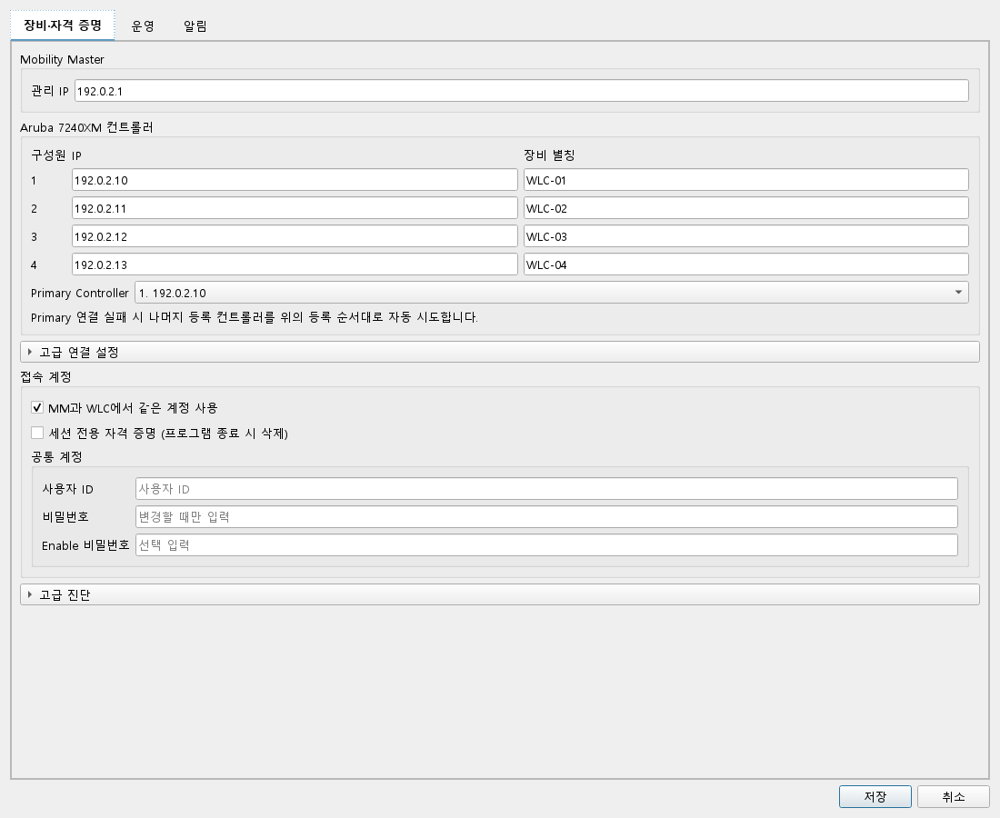
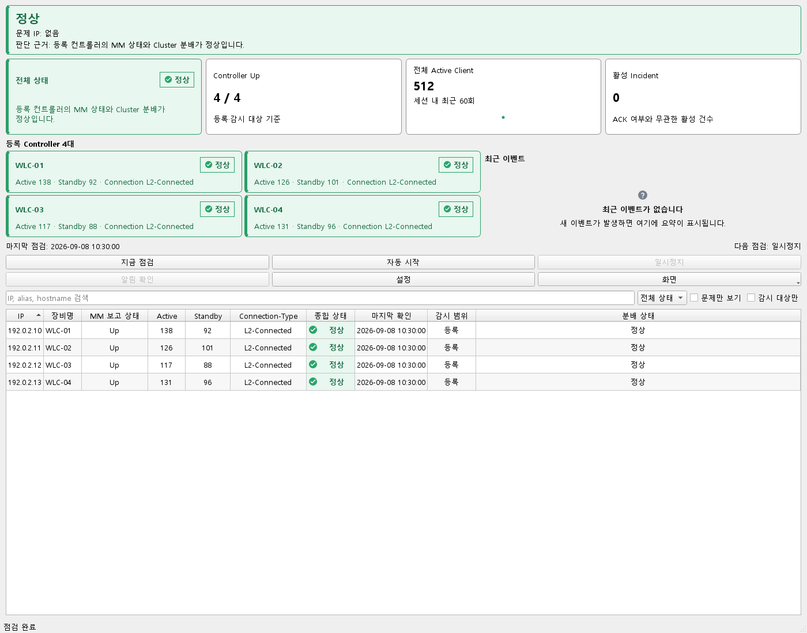
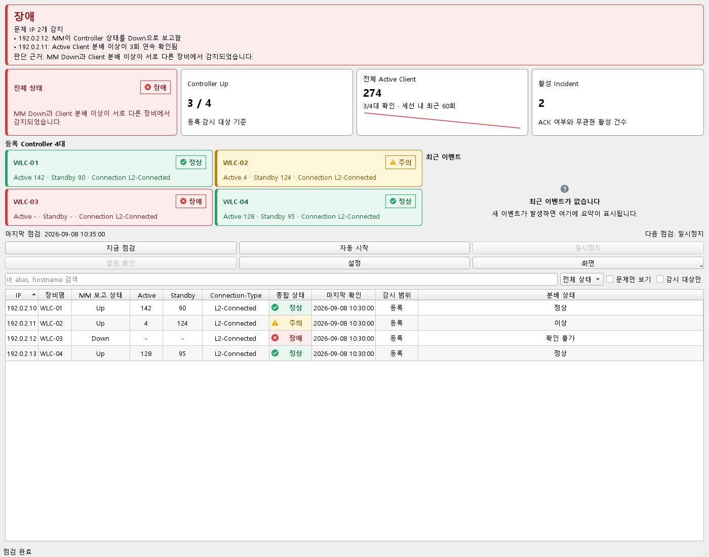
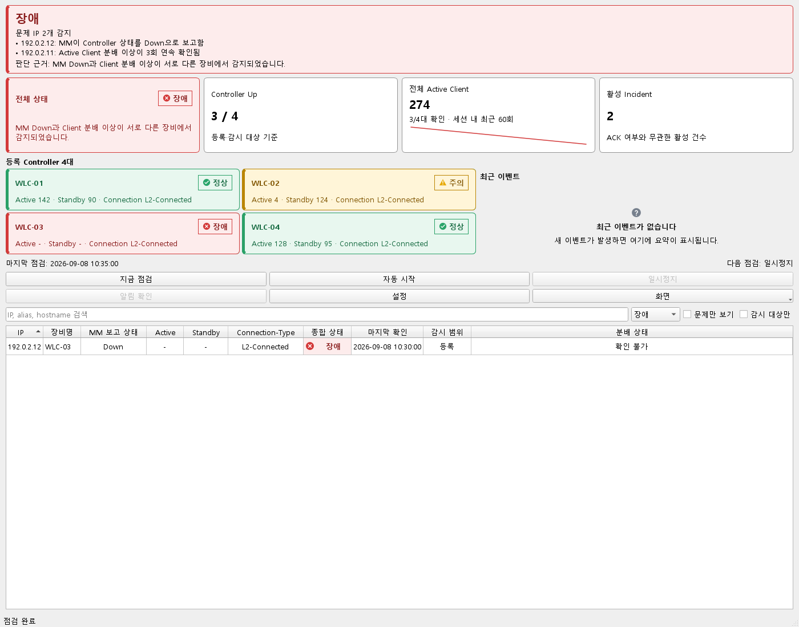

# 화면으로 따라가는 클러스터 상태 확인

아래는 **v0.7.0 실제 MainWindow와 SettingsDialog**를 문서용 합성 snapshot으로 렌더한 화면입니다. 목업이 아니며 실제 장비·계정·SSH는 사용하지 않았습니다. 운영 결과를 재현한 사례가 아니라 현재 프로그램에서 어떤 값을 읽고 다음 행동을 정할지 보여주는 예시입니다.

## 1. 등록 범위와 Primary 확인



- **사용 행동:** `설정`에서 MM 관리 IP, 등록 컨트롤러의 IP·별칭과 Primary를 확인합니다.
- **읽을 값:** 감시할 4대가 올바른지, Primary 실패 시 어느 등록 순서로 Fallback을 시도하는지 읽습니다. 고급 연결 설정과 세션 전용 자격 증명 선택도 이 화면에 있습니다.
- **다음 행동:** 실제 운영에서는 조직에서 승인된 계정과 확인한 호스트 키로 초기 설정을 완료합니다. 예시 계정 입력란은 비어 있고 저장·연결 확인은 실행하지 않았습니다.

## 2. 개요에서 확인 범위를 먼저 읽기



- **사용 행동:** `지금 점검`으로 한 번 수집하거나 `자동 시작`으로 반복 관측합니다.
- **읽을 값:** 전체 상태뿐 아니라 Controller Up의 분모, 확인 가능한 Active Client, 활성 Incident와 마지막 점검 시각을 함께 봅니다. 예시는 4대 모두 Up, 합성 Active 합계 512입니다.
- **다음 행동:** 카드와 하단 장비표가 같은 대상을 설명하는지 확인한 뒤 이상이 있는 IP로 좁힙니다. 마지막 관측 시각이 오래되면 현재 상태로 단정하지 않습니다.

그래프는 앱 세션 내 최근 최대 60회 표시이며 장기간 저장된 성능 추세가 아닙니다. 정상 예시는 첫 snapshot 1개라 점 하나만 보입니다. 문서 renderer는 이벤트 저장소를 연결하지 않아 최근 이벤트 영역은 비어 있습니다.

## 3. 서로 다른 이상을 분리



- **사용 행동:** 상단 문제 IP와 각 Controller 카드를 대조합니다.
- **읽을 값:** 예시의 WLC-02는 Active Client 분배 이상을 3회 확인한 `주의`, WLC-03은 MM이 Down으로 보고한 `장애`입니다. WLC-03의 Client 값은 제공하지 않았으므로 전체 Active 합계에도 확인된 3대만 사용합니다. 활성 Incident 2건은 합성 snapshot의 값입니다.
- **다음 행동:** 대상 행을 선택해 상세 근거를 확인합니다. SSH 수집 실패를 장비 Down으로 바꿔 읽지 않습니다. `알림 확인`(ACK)은 복구 확인과 별개입니다.

그래프의 선은 정상·이상 snapshot 2개를 실제 UI에 순서대로 전달한 결과입니다. 연속 3회 판단을 실제 파서/엔진에서 실행한 캡처는 아닙니다. 해당 판단과 복구 흐름을 재현하려면 아래 Demo 모드를 사용합니다.

## 4. 장애 필터로 조사 대상 좁히기



- **사용 행동:** 상태 선택에서 `장애`를 고르거나 IP·별칭·hostname으로 검색합니다.
- **읽을 값:** 표에는 장애인 WLC-03 한 행만 남지만 위쪽 개요는 전체 감시 범위의 상태·합계를 유지합니다. 필터 결과를 전체 장비 수로 오해하지 않습니다.
- **다음 행동:** 개별 근거를 확인한 후 `전체 상태`로 돌아가 다른 주의·확인 불가 대상을 놓치지 않았는지 점검합니다. `문제만 보기`와 상태 필터는 목적이 다릅니다.

## 캡처 출처와 재현

캡처 소스: `9d4b153d93de60b25b90af19a1494f26b4175f38`. [Windows 생성 실행 34177086666](https://github.com/sebia1993/aruba-cluster-health-dashboard/actions/runs/34177086666)에서 4개 PNG를 내려받아 직접 검토했습니다.

- 앱 버전: **0.7.0**. 캡처 SHA·실행 ID·각 PNG 크기와 SHA-256은 [capture-metadata.json](images/capture-metadata.json)에 기록합니다.
- 도구: [기존 Qt 문서 renderer](../scripts/render_docs_screenshots.py), [Windows 캡처 workflow](../.github/workflows/docs-screenshots.yml).
- 빈 상태 문구 잘림의 회귀 검사는 1080/1400/1920px에서 필요한 문구 높이를 비교합니다. 캡처 workflow에서 관련 위젯·반응형 검사 17개가 Windows에서 통과했습니다. 이 이미지는 1400×1100 개요/필터와 1100×900 설정 창입니다.
- 환경: GitHub Actions `windows-latest`의 **Windows Server 2025**, CPython 3.13.15 x64, PySide6 6.11.0, Qt offscreen 100%, Windows 내장 Malgun Gothic. 물리 Windows 11·멀티모니터 검증이 아닙니다.
- 입력: RFC 5737 문서 IP, 가상 장비명, 고정 시각, 합성 정상/이상 snapshot과 Incident. CoordinatorStub은 네트워크 일을 하지 않고 Python socket 연결도 차단합니다. 수집·판정 로직은 변경하지 않았습니다. 빈 상태 보조 문구가 가용폭을 쓰도록 한 최소 레이아웃 수정은 [미배포 변경 이력](../CHANGELOG.md)에 기록했습니다.

저장소 루트의 Windows PowerShell에서:

```powershell
py -3.13 -m venv .venv
.\.venv\Scripts\python.exe -m pip install -r requirements-lock.txt
$env:PYTHONPATH = "src"
$env:QT_QPA_PLATFORM = "offscreen"
$env:QT_SCALE_FACTOR = "1"
.\.venv\Scripts\python.exe scripts/render_docs_screenshots.py --output artifacts/docs-screenshots
```

workflow artifact `usage-screenshots-windows`는 PNG와 출처 JSON만 담습니다. source/도구가 바뀌면 재생성하고 글자·표·출처를 직접 확인한 뒤 공개 이미지를 갱신합니다. macOS에서도 PySide6 6.11 환경과 `PYTHONPATH=src`로 이 renderer를 실행할 수 있지만 글꼴·시간대·윈도 장식이 달라 Windows 캡처를 대체하지는 않습니다.

실제 parser/correlation까지 장비 없이 따라가려면 포터블 앱에서:

```powershell
.\ArubaMiniDashboard.exe --demo
```

Demo는 비식별 CLI fixture를 실제 parser와 상관 엔진에 전달해 정상 → Client 저하 1/3·2/3·3/3 → Connection-Type 변화 → MM Down → 복구 1/2·2/2를 순환합니다. 이때 단계 전환/Connection-Type 기준 수용은 데모 시나리오이며 운영 판단을 대신하지 않습니다. 자동·단위/패키지 검증과 현장 한계는 [포트폴리오 사례](PORTFOLIO_KO.md)를 참고하십시오.
